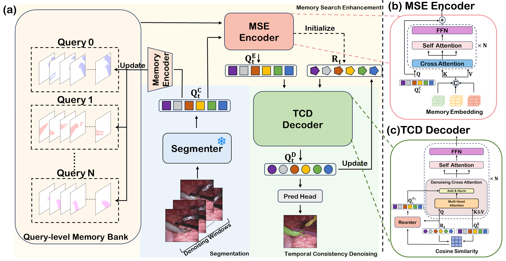
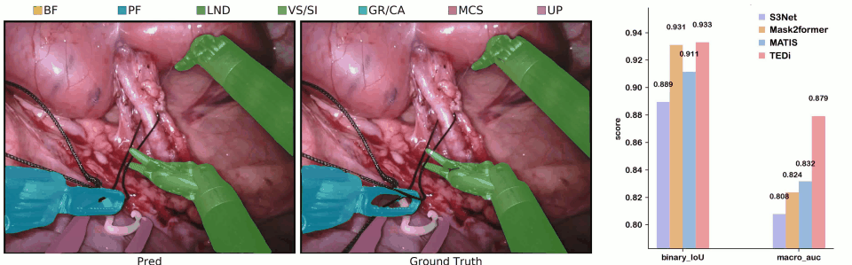

# TEDi

**TEDi: Temporal Memory-Enhanced and Denoising Transformer for Surgical Instrument Segmentation**

TEDi combines a Swin Transformer and Mask2Former segmentation head with an MSE memory module and a TCD temporal denoising decoder. MSE enriches query features with temporal memory; TCD aligns queries across frames and refines them with referring cross-attention, self-attention, and feed-forward layers.

This README describes the current source tree. The temporal decoder is referred to as **TCD** or **`denoising_decoder`** throughout the documentation.

<p align="center">
  
</p>

<p align="center">
  <a href="fig/tedi_demo_10s.mp4">
    
  </a>
</p>


## Repository Structure

```text
TEDi/
├── configs/
│   └── ...
├── Data/
│   └── ...
├── modeling/
│   ├── TCD/
│   ├── MSE/
│   └── ...
├── utils/
│   └── ...
├── fig/
│   └── ...
├── train.py
├── maskformer_train.py
└── requirements.txt
```


## Environment

Install PyTorch and torchvision compatible with the local CUDA toolchain, then install the project dependencies from the repository root:

```bash
pip install -r requirements.txt
```

The requirements specify minimum versions, not a fully pinned environment. Detectron2 is also required by the data transforms and model components, but is not listed in `requirements.txt`; install a build compatible with the selected PyTorch/CUDA environment.

Build the custom multi-scale deformable attention operator:

```bash
cd modeling/pixel_decoder/ops
sh make.sh
cd ../../..
```

Training and the CLI evaluation path require CUDA.

## Data Preparation

Prepare one HDF5 file per frame with these fields:

| Field | Contents |
| --- | --- |
| `image_left` | RGB image, `H × W × 3` |
| `mask` | Integer semantic labels, `H × W`; background `0`, instrument classes `1..7` |
| `name` | UTF-8 byte string identifying the frame |

The default loaders read `image_left`. Use filenames such as `seq_1_frame000.h5`, with a three-digit frame index. The current dataset code clamps neighboring frame indices to `0..148`; the referenced neighboring files must exist in the same directory.

For EndoVis 2018:

```text
data/endovis2018/
├── train/
│   ├── seq_1_frame000.h5
│   └── ...
└── test/
    ├── seq_2_frame000.h5
    └── ...
```

For EndoVis 2017, put the HDF5 files in a single directory. `train.py` selects validation sequences by fold; other sequences in that directory form the training split.

| Fold | Validation sequences |
| --- | --- |
| 0 | 1, 3 |
| 1 | 2, 5 |
| 2 | 4, 8 |
| 3 | 6, 7 |


## Training

Run commands from the repository root.

EndoVis 2018:

```bash
CUDA_VISIBLE_DEVICES=0 python train.py \
  --config configs/tedi.yaml \
  --dataset EndoVis2018 \
  --data-root /path/to/endovis2018 \
  --output-dir outputs/endovis2018 \
  --task tedi_endovis2018 \
  --batch-size 4 --workers 8 --epochs 120
```

EndoVis 2017, fold 0:

```bash
CUDA_VISIBLE_DEVICES=0 python train.py \
  --dataset EndoVis2017 \
  --data-root /path/to/endovis2017 \
  --fold 0 \
  --output-dir outputs/endovis2017 \
  --task tedi_endovis2017
```

## Evaluation and Outputs

```bash
CUDA_VISIBLE_DEVICES=0 python train.py \
  --dataset EndoVis2018 \
  --data-root /path/to/endovis2018 \
  --checkpoint /path/to/tedi.pth \
  --infer-only --epochs 2 \
  --output-dir outputs/evaluation \
  --task tedi_eval
```


Evaluation reports EndoVis `IoU`, `challengIoU`, `mcIoU`, `mIoU`, and per-class IoU, excluding background.

## Citation and Acknowledgements

If you use TEDi in your research, please cite:

```bibtex
@inproceedings{yuan2026tedi,
  title={TEDi: Temporal Memory-Enhanced and Denoising Transformer for Surgical Instrument Segmentation},
  author={Yuan, Jiahong and Mi, Weiming and Zhang, Tao and Zhou, Haoyin},
  booktitle={Medical Image Computing and Computer Assisted Intervention -- MICCAI 2026},
  year={2026}
}
```

This project builds upon [Mask2Former](https://github.com/facebookresearch/Mask2Former) and [Mask2Former-Simplify](https://github.com/zzubqh/Mask2Former-Simplify). See [THIRD_PARTY_NOTICES.md](THIRD_PARTY_NOTICES.md) for notices concerning the custom deformable attention operator.
